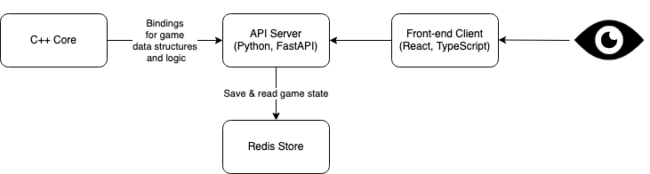

# blackjack

## 

An experimental project to explore C++ --> Python bindings (made using pybind11) and utilizing them to create a Blackjack game service with Python and FastAPI. Everything exposed through a React frontend.

