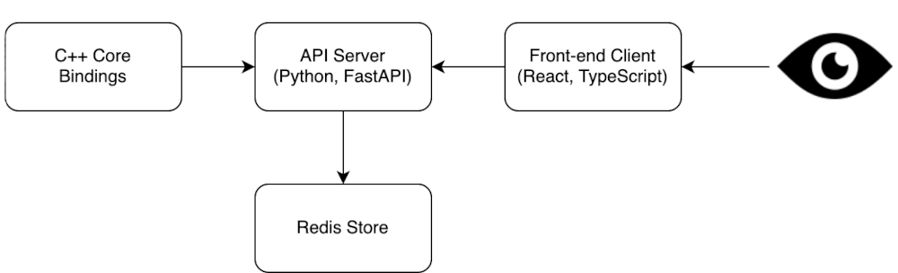

# blackjack

## 
An experimental project that explores C++ --> Python bindings (made using pybind11) and utilizes them to create a Blackjack game service with Python and FastAPI. Everything exposed through a React frontend.

---

---

- Front-end test coverage: 
- C++ core test coverage: Probably ~99%
- API test coverage: not tested (yet?) :(